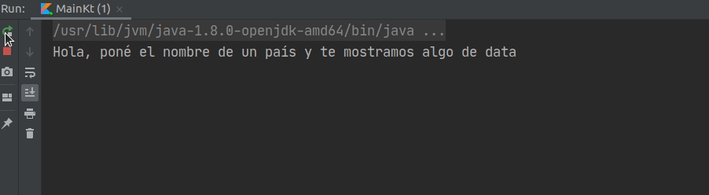
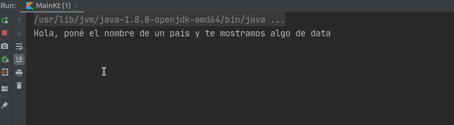

# Países impostores


## Antes de empezar: algunos consejos

El enunciado tiene **mucha** información, van a necesitar leerlo varias veces. La sugerencia es que lo lean entero una vez (para tener una idea general) y luego vuelvan a consultarlo las veces que hagan falta.

Concentrensé en los requerimientos y, excepto que se traben mucho, respeten el orden sugerido. No es necesario que hagan TDD, pero sí sería interesante que vayan creando las distintas clases y métodos a medida que resuelven cada requerimiento y no antes. 

En otras palabras: trabajen completando cada requerimiento antes de pasar al siguiente, con los tests que aseguran que funciona incluidos. Si al avanzar en los requerimientos les parece necesario refactorizar, adelante, van a tener los tests que garantizan que no rompieron nada. :smirk: 

## Descripción del dominio

Desde un observatorio de políticas públicas mundiales nos piden desarrollar un sistema para realizar estadísticas sobre distintos países del mundo. Según detallaron, de cada país les interesaría saber:

* su nombre,
* su código ISO-3 (llamado en realidad [ISO 3166-1 alfa-3](https://es.wikipedia.org/wiki/ISO_3166-1)),
* su población,
* su superficie,
* en qué continente está ubicado,
* el código de la moneda local ([ISO 4217](https://es.wikipedia.org/wiki/ISO_4217)),
* la cotización del dólar en la moneda local,
* la lista de países con los que limita,
* la lista de bloques regionales en los que participa,
* la lista de idiomas oficiales que reconoce.

Por simplicidad, manejaremos al continente, los bloques regionales y los idiomas como `String`. Por ejemplo, podríamos representar a Bolivia con los siguientes datos:

```kotlin
nombre: "Bolivia"
codigoIso3: "BOL"
poblacion: 10985059
superficie: 1098581.0
continente: "América"
codigoMoneda: "BOB"
cotizacionDolar: 6.89
// Notar que estos son objetos, no strings
paisesLimitrofes: [argentina, brasil, chile, paraguay, peru]  
bloquesRegionales: ["UNASUR"]
idiomasOficiales: ["Español", "Quechua", "Aymara"]
```

## Requerimientos

Dividimos los requerimientos en varias etapas distintas, cuyo orden debe ser respetado. El ejercicio está planteado de esta manera para que el diseño les quede más prolijo y desacoplado.

### Etapa 1 - Calentando motores

Modelar los países con los atributos mencionados y resolver los siguientes requerimientos.

#### Para un país:

1. Indicar si **es plurinacional**. En una mega-simplificación de este concepto, diremos que un país es plurinacional si tiene más de un idioma oficial.
1. Saber si **es una isla**, lo cual es cierto si no tiene ningún país limítrofe.
1. Calcular su **densidad poblacional**, la cual se obtiene dividiendo a la población por la superficie. Para no tener problemas en etapas posteriores, redondeen este número de forma tal que devuelva un entero (pueden usar `roundToInt()` para eso).
1. Conocer al **vecino más poblado**, que sería el país con mayor población dentro de la vecindad, que incluye tanto a los limítrofes como al país que consulta. Por ejemplo: asumiendo que Brasil es el país más poblado de su vecindad, tanto `brasil.vecinoMasPoblado()` como `peru.vecinoMasPoblado()` nos deberían dar como resultado `brasil`.

#### Para dos países en particular:

1. Poder consultar si **son limítrofes**.
1. Saber si **necesitan traducción** para poder dialogar. Esto ocurre si no comparten ninguno de sus idiomas oficiales.
1. Conocer si **son potenciales aliados**. Esto es así cuando no necesitan traducción y además comparten algún bloque regional.
1. Saber si **conviene ir de compras** de uno al otro, lo cual diremos que es verdadero cuando la cotización del dólar en el país de destino es mayor. Por ejemplo, si en Argentina la cotización es de `190` y en Bolivia de `6.89`, **no** conviene ir de Argentina a Bolivia pero **sí** al revés.
1. Conocer **a cuánto equivale** un determinado monto en la moneda local, transformado en la moneda del país de destino. Como la referencia que estamos tomando es el precio del dólar, la equivalencia se haría convirtiendo primero a dólar y luego a la moneda de destino.

> :bulb: **Ayuda:** a estas consultas conviene modelarlas con métodos del `Pais` que reciban al segundo país por parámetro. Por ejemplo: `peru.esLimitrofeDe(honduras)`.

### Etapa 2 - Observatorio

Crear al Observatorio, que es un objeto que conoce a todos los países y debe poder responder las consultas que se enuncian a continuación. 

Para dos países en particular, **cuyos nombres** se envían por parámetro, se pide poder resolver las mismas consultas de la etapa anterior:

1. Poder consultar si **son limítrofes**.
1. Saber si **necesitan traducción** para poder dialogar
1. Conocer si **son potenciales aliados**.
1. Saber si **conviene ir de compras**.
1. Conocer **a cuánto equivale** un determinado monto en la moneda local, transformado en la moneda del país de destino.

Ojo, que se pide (a propósito) que los parámetros sean **los nombres** de los países y no los objetos que los representan - de hecho es lo único que cambia entre esta etapa y la anterior. Para este punto puede resultar un poco molesto, pero nos va a facilitar la etapa siguiente.

Sobre el conjunto de **todos los países**:

4. Obtener los códigos ISO de los 5 países con mayor densidad poblacional.
5. Indicar el nombre del continente con más paises plurinacionales.
6. Conocer el promedio de densidad poblacional de los países insulares (o sea, aquellos países que son islas).

### Etapa 3 - Conectando con el mundo real

#### RestCountriesAPI - info de los países

Queremos ahora modificar al Observatorio para que pueda resolver todos los requerimientos anteriores, pero esta vez interactuando con la [API RestCountries](http://restcountries.eu/). Esta [API](https://es.wikipedia.org/wiki/Interfaz_de_programaci%C3%B3n_de_aplicaciones) es un servicio gratuito que brinda información real sobre los países del mundo.

Para facilitarles la interacción con dicho servicio y que no tengan que preocuparse por cuestiones propias de la interacción HTTP, les dejamos la clase `RestCountriesAPI`, que provee tres métodos para hacer consultas:

```kotlin
// Devuelve una lista con todos los países del mundo.
todosLosPaises(): List<Country>

// Devuelve todos los países cuyo nombre incluya el String que viene por parámetro. 
// Ejemplo: si ponemos "guay" devolverá a Paraguay y Uruguay, 
// pero si ponemos "uruguay" devolverá solo a este último.
buscarPaisesPorNombre(nombre: String): List<Country>

// Devuelve al país cuyo código ISO 3 coincide con el parámetro. 
// Arroja un error si no existe ningún país con ese código.
paisConCodigo(codigoIso3: String): Country
```

Nótese que los objetos que devuelve esta clase son de tipo `Country`, y que probablemente tengan una estructura diferente a los que ustedes crearon en la etapa anterior. Para no tener que tirar todo el código del `Observatorio`, conviene crear un objeto que oficie de _transformador_ entre el `Country` que devuelve la API y el `Pais` que ustedes crearon.

**⚠️ Importante:** hay algunos atributos cuyos valores **no vienen** para todos los países, y están marcados como anulables en la clase `Country`. Para no tener que modificar los objetos `Pais`, les dejamos algunas decisiones:
1. Si la `capital` viene nula, usar el string `"No especificada"` como capital.
2. Si el `area` viene nula, usar el mismo valor que tenga para `population` como area.
3. Pueden asumir que ni `borders`, ni `regionalBlocs`, ni `currencies` van a ser nulas (pero sí pueden ser listas vacías).
4. Si viene más de una `currencies`, utilicen la primera. Y si no viene ninguna, usen `USD` como código de moneda.

> :bulb: **Ayuda:** como parte del pasaje de un `Country` a un `Pais`, van a tener que transformar los códigos de países limítrofes que devuelve la API en objetos Países. Para evitar que se genere un bucle infinito, les recomendamos _no transformar_ los países limítrofes de los limítrofes. 

#### CurrencyConverterAPI - cotización

Un pequeño detalle: la RestCountriesAPI devuelve el código de la moneda **pero no** su cotización. Para obtener la cotización, van a tener que utilizar la `CurrencyConverterAPI`, que también les dejamos en el proyecto. 

Su interfaz es mucho más sencilla:

```kotlin
// Dado un código válido de moneda, devuelve la cotización del dólar para esa moneda.
convertirDolarA(codigoMoneda: String): Double
```

:warning: Esta API necesita de una clave que puede [obtenerse aquí](https://free.currencyconverterapi.com/free-api-key), o pedile a tu docente que te facilite una.

#### Requerimientos

Se pide entonces:

1. Hacer un objeto o clase que sepa cómo transformar un objeto `Country` a un objeto `Pais`. Este objeto va a necesitar conocer a ambas APIs, para poder hacer las consultas necesarias. Incluir los tests correspondientes.
1. Modificar al Observatorio para que sus consultas interactúen con la API. Utilizando el adaptador que crearon en el requerimiento anterior, no deberían necesitar modificar mucho el código que ya tienen.
1. En las consultas que buscan países por nombre, arrojar errores si:
  * Se ingresa ambas veces al mismo país. Ejemplo: `observatorio.sonLimitrofes("Panamá", "Panamá")`.
  * Alguno/s de los países ingresados no existe/n. Ejemplo: `observatorio.necesitanTraduccion("Venezuela", "Sarasa")`.
  * Hay más de un país cuyo nombre coincida con el parámetro de búsqueda. Ejemplo: `observatorio.sonPotencialesAliados("mbia", "Cabo Verde")`.

**:warning: Importante:** una vez que conecten al Observatorio con la `RestCountriesAPI`, se les van a romper los tests (porque los datos reales no van a ser los mismos que ustedes inventaron). Los arreglaremos en la etapa siguiente. 

### Etapa 4 - API impostora

Los tests de la etapa anterior tienen un gran problema - cada vez que los ejecutamos hacen varios llamados a la API. Esto, además de ser bastante más lento que un test "puro", tiene otras desventajas: no podemos correrlos sin acceso a internet, nos acopla fuertemente con un servicio externo, no podemos decidir sobre los datos, etc.

Para solucionar esto, se pide modificar todos los tests que utilicen a las APIs, reemplazandolas por impostores implementados con [mockk](https://mockk.io/).

### Etapa 5 - Usando la aplicación

Llegó el momento de realmente conectar a nuestro programa con el mundo real, permitiendo que "cualquier persona" (que tenga una computadora, Kotlin y los conocimientos necesarios para ejecutarlo) pueda utilizarlo.

Para ello, vamos a programar una pequeña CLI, _command line interface_ o _interfaz por línea de comandos_, que nos permita acceder a los requerimientos de las dos primeras etapas, trayendo la información de la RestCountries API. El diseño de la interfaz queda librado a su creatividad, siempre y cuando cumpla con los siguientes requerimientos:

1. Deben poder realizarse todas las consultas de las dos primeras etapas, interactuando con la API real.
1. En caso de que los datos que se ingresan sean erróneos, hay que mostrar algún mensaje amigable.
1. Incluir al menos un test por cada opción que tenga el CLI, y alguno donde se muestre un error. Simular la interacción de usuario y la interacción con la RestCountriesAPI utilizando mockk. En otras palabras: ningún test debería traer datos de la API real, todos los datos de países que utilicen deben ser mockeados.

A modo de ejemplo, les dejamos unos GIFs mostrando cómo podría ser la interacción:

_Caso feliz :smiley:_


_Error :cry:_



## Licencia
  
Esta obra fue elaborada por [Federico Aloi](https://github.com/faloi) y publicada bajo una [Licencia Creative Commons Atribución-CompartirIgual 4.0 Internacional][cc-by-sa].

[![CC BY-SA 4.0][cc-by-sa-image]][cc-by-sa]

[cc-by-sa]: https://creativecommons.org/licenses/by-sa/4.0/deed.es
[cc-by-sa-image]: https://licensebuttons.net/l/by-sa/4.0/88x31.png

### Créditos

:memo: Inspirado levemente en un enunciado de [Carlos Lombardi](https://github.com/clombardi).

:camera_flash: Imagen de portada por <a href="https://unsplash.com/@gabrielrojas?utm_source=unsplash&utm_medium=referral&utm_content=creditCopyText">Gabriel Rojas</a> en <a href="https://unsplash.com/s/photos/banderas-uyuni?utm_source=unsplash&utm_medium=referral&utm_content=creditCopyText">Unsplash</a>.
